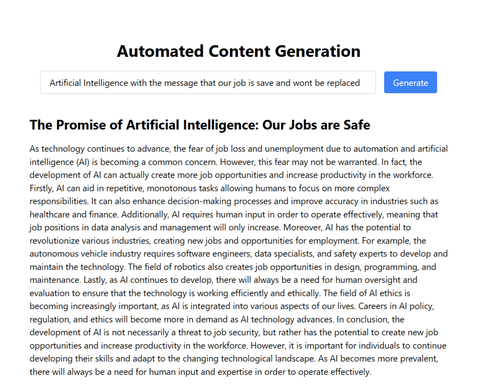

# Automated Content Generation

This project use OpenAI, Stable Diffusion (Replicate.com), GridDB, and Node.js. Make sure you you have access to OpenAI, Replicate.com as well as GridDB and Node.js already installed in your system.

## Run the project

Clone this repository

```
git clone https://github.com/junwatu/automated-content-generation.git

cd automated-content-generation

npm install
```

Rename `.env.example` to `.env` and then set the API keys:

```
OPENAI_API_KEY=
OPENAI_API_ORG=
REPLICATE_API_KEY=
```

Run the project

```
npm run dev
```

Open the browser and got to the `http://localhost/3000`




