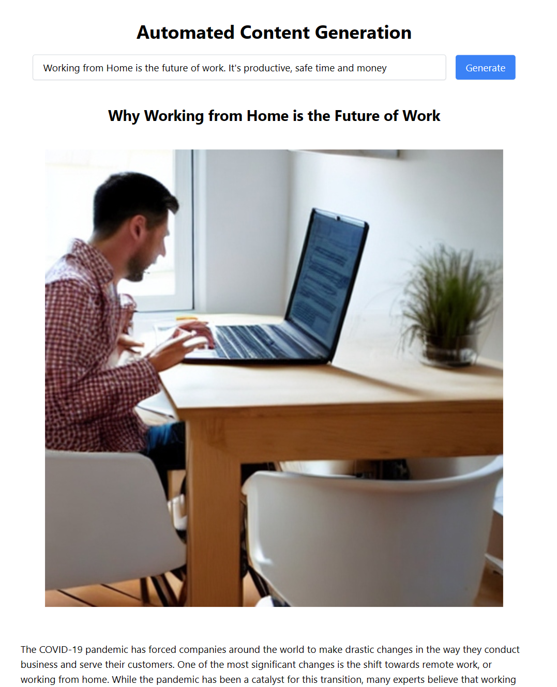

# Automated Content Generation

This project use OpenAI, Stable Diffusion (Deep.ai), GridDB, and Node.js. Make sure you you have access to OpenAI and Deep.ai as well as GridDB and Node.js already installed in your system.

## Run the project

Clone this repository

```
git clone https://github.com/junwatu/automated-content-generation.git

cd automated-content-generation

npm install
```

Rename `.env.example` to `.env` and then set the API keys:

```
OPENAI_API_KEY=
```

Set the Deep.ai API key in `index.html`

```
deepai.setApiKey("DEEPAI_API_KEY");
```

Run the project

```
npm start
```

Open the browser and got to the `http://localhost/3000`


