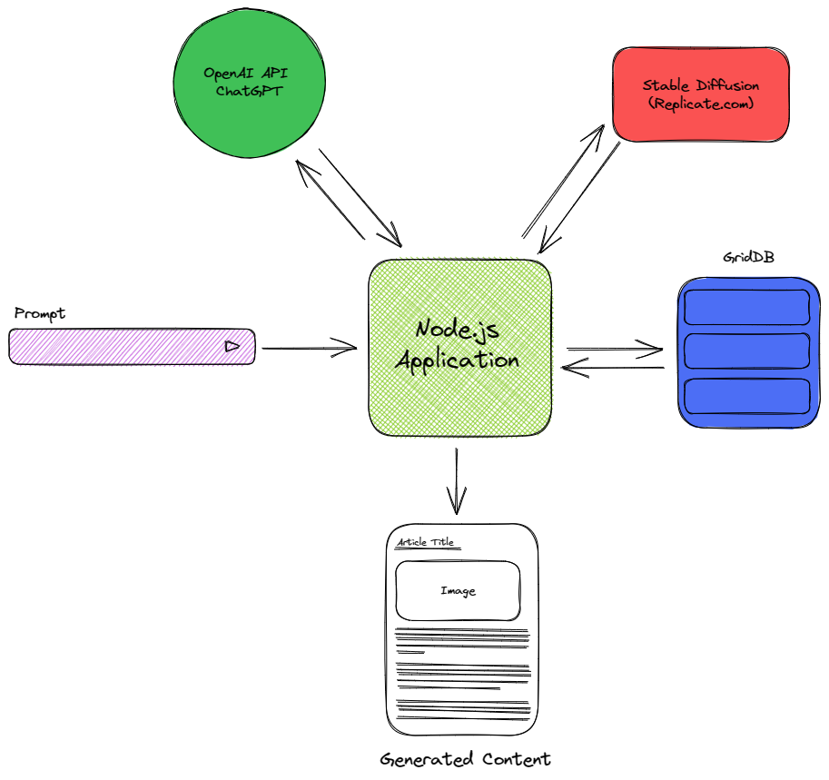

# Automated Website Content Generation using ChatGPT, Stable Diffusion, GridDB, and Node.js

In today's digital era, the creation of high-quality, engaging, and relevant content has become crucial for businesses and organizations to attract and retain their target audience. Content generation involves a wide range of activities, from writing articles and blog posts to crafting social media updates and marketing materials. As the demand for content continues to grow, manual content creation can become increasingly time-consuming and labor-intensive, often leading to delays and inconsistencies in output quality.

Automated content generation offers a solution to these challenges by leveraging advanced technologies like artificial intelligence (AI) and natural language processing (NLP) to create well-structured, coherent, and contextually relevant content. By automating the content creation process, businesses can:

- **Increase efficiency**: Automated content generation can significantly reduce the time and effort required to create content, enabling teams to focus on more strategic tasks, such as content planning and optimization.

- **Enhance consistency**: By using algorithms and pre-defined templates, automated content generation ensures a consistent style, tone, and format across different types of content, leading to a more cohesive brand identity.

- **Scale content production**: Automated systems can easily generate large volumes of content in a short period, allowing organizations to scale their content production efforts to meet the growing demand without increasing their workforce.

- **Personalize content**: Advanced AI-powered content generation systems can analyze user data and preferences to create personalized content that appeals to specific audience segments, resulting in improved engagement and conversion rates.

- **Improve content quality**: By utilizing NLP techniques and machine learning algorithms, automated content generation systems can generate content with fewer grammatical errors and ensure it is contextually relevant to the target audience.

## Tech Stacks

Choosing the right technology stack can be quite a challenge. It really hinges on your business needs, the platform you're working with, and the budget you've got at hand. When it comes to automated content generation, JavaScript comes out as a pretty solid pick for development. What's cool about JavaScript is that you can use it for both front-end and back-end development. This means you get to cut down on development time and cost, which is always a win.

For the automation content generation we use these four main technologies: **GPT-4**, **Stable Diffusion**, **GridDB**, and **Node.js**.

### GPT-4

GPT-4 is a **multimodal large language model** created by **OpenAI**, and the fourth in its numbered "GPT-n" series of GPT foundation models. It was released on **March 14, 2023**, and has been made publicly available in a limited form via the chatbot product **ChatGPT Plus** (a premium version of ChatGPT), and with access to the GPT-4 based version of OpenAI's API being provided via a waitlist . GPT-4 can take images as well as text as input, and can perform various tasks with few examples, such as composing songs, writing screenplays, or solving problems.

### Stable Diffusion

Stable diffusion is a deep learning, text-to-image model released in 2022. It is primarily used to generate detailed images conditioned on text descriptions, though it can also be applied to other tasks such as inpainting, outpainting, and generating image-to-image translations guided by a text prompt. It was developed by the start-up Stability AI in collaboration with a number of academic researchers.

### GridDB

GridDB is a highly scalable, in-memory time series database optimized for IoT and Big Data. Its in-memory data architecture coupled with parallel processing technology makes GridDB faster than any other time series databases. GridDB offers strong data consistency at the container level and provides ACID transaction guarantees similar to that of an RDB. Proprietary algorithms of GridDB allow nodes to be added on the fly online without having to stop the service or operation. Compared to other NoSQL databases, GridDB has the unique ability to handle IoT (Internet of Things) data thanks to its Key-Container data model.

### Node.js

Node.js is an open-source, cross-platform JavaScript runtime environment used for executing JavaScript code outside of a web browser. It is built on Google’s V8 JavaScript engine, the same one used for processing in Chrome. Node.js is commonly used for building applications, working with modern web app frameworks, and server-side scripting with JS1. It is also great for data-intensive applications like streaming and real-time apps.

## What's Tough about Content Creation

Before we delve into the solution, it's important to fully understand the problem at hand. The digital age has introduced an increasing demand for diverse, high-quality content. However, this demand has also brought two key issues: challenges in content generation and limitations of previous automated content generation methods.

### Challenges in Content Generation

Content generation is a complex process, often made more difficult by factors such as maintaining consistency, ensuring relevancy, and dealing with the sheer volume of content needed in a dynamic digital marketplace. The need for regular content updates, and personalized content for various user segments adds another layer of complexity. The process also requires significant human resources, time, and effort, which sometime can be impractical for many organizations, especially when it comes to scaling up content production.

### The Limitations of Previous Automated Content Generation Methods

Previous attempts to automate content generation have been met with varying degrees of success. Some of the common limitations include lack of creativity and originality in the generated content, inability to produce content that is contextually relevant, and incapacity to cater to specific user preferences. Additionally, many automated systems struggled with maintaining a natural language flow, often resulting in content that seemed robotic or inauthentic.

## Why We Need Better Content Solutions

Once we understand the problems that come with content generation, it's easy to see the ripple effect they can have on the overall functioning of a business or platform. The issues aren't just isolated problems - they stir up some serious inefficiencies, making it hard to keep pace with the demands of our digital world. This section is all about highlighting these struggles, and emphasizing why there's a desperate need for scalable and customizable content solutions.

### Inefficiencies Caused by Manual Content Creation

Manual content creation is a bit of a double-edged sword. On one hand, it allows for a personalized touch and human creativity. On the other hand, it can be a slow and labor-intensive process that doesn't always produce consistent results. The demand for content is often high and urgent, and the manual approach simply can't keep up, leading to bottlenecks and delays.

### The Importance of Staying Relevant in A Fast-paced Digital World

In the digital era, content isn't just king - it's the whole kingdom. The competition is fierce, and staying relevant means constantly producing fresh, engaging, and innovative content that caters to the evolving needs of your audience. Falling behind isn't an option, as it can quickly lead to loss of visibility and engagement.

### The Need For Scalable and Customizable Content Solutions

This constant need for new, personalized content underlines the importance of having scalable and customizable content solutions. Being able to ramp up content production without compromising on quality or personalization is key. After all, your content needs to reach and resonate with a broad audience, each with their own unique preferences and needs.

## Automated Content Generation Solution

The system we will build can be explained using the general system diagram below.



The generated content depends on the user's input prompt. The user input interface is provided by a React.js web application. Internally, JavaScript will make an API call to OpenAI to generate the content text. It will also make a request to the Stable Diffusion model on deep.ai to generate an image. Subsequently, the produced text and image are stored in GridDB. The stored data is then rendered for display via the node.js server application.

### GPT-4-based Content Generation

Generative Pre-trained Transformer 4, or GPT-4, is a highly sophisticated language model developed by OpenAI. It's built on a deep learning architecture known as a transformer, which allows the model to generate human-like text with remarkable accuracy.

The primary capability of GPT-4 lies in its understanding of context. The model analyzes the input or prompt provided, and based on the patterns it has learned from its extensive training on diverse datasets, it generates text that's coherent and contextually relevant. It's capable of tasks ranging from simple ones, like completing a sentence or paragraph, to complex ones, like writing an essay, a story, or even technical content.

When it comes to GPT-4-based content generation, these capabilities translate into several key benefits. The model can produce high-quality content at scale, significantly reducing the time and resources required for content creation. Its ability to generate contextually relevant and engaging content means you can cater to a variety of user needs and preferences, enhancing personalization. Furthermore, with GPT-4, you can maintain a consistent style and tone across all your content, strengthening your brand's identity.

### Stable Diffusion for Image Generation

Stable Diffusion is used for generating images automatically for website content. We employ the [deep.ai](deep.ai) website for image generation because hosting Stable Diffusion on a standalone PC or cloud can be tedious and expensive. It is simpler to use an API call from deep.ai instead.

### GridDB for efficient data storage

In the world of content creation, especially when we're talking about automated content generation, managing and storing the vast amounts of data involved is a crucial task. This is where GridDB comes into play. Known for its high-performance, scalability, and robustness, GridDB can significantly streamline the data management aspect of your content generation process.

GridDB can play a pivotal role in supporting the content generation process. For instance, it can store and manage the diverse data inputs required for content generation, such as user profiles, content preferences, historical data, and more. It can also handle the output data, like the generated content and associated metadata.

By providing efficient and reliable data management, GridDB helps keep the content generation pipeline smooth and uninterrupted. It also assists in organizing the content effectively, making it easier to retrieve, update, and utilize the generated content as and when required.

### React.js for a seamless web development experience

Building and maintaining a dynamic and efficient web platform is a critical aspect of content management. It's not just about generating content, but also about presenting it effectively to the end user. This is where React.js, comes into the picture.

One of the key strengths of React.js is its flexibility. Whether you're building a single-page application, a static blog, or a complex e-commerce site, React.js can handle it. It's designed with performance in mind, ensuring your website is not only functional, but also fast and responsive.

In the following sections, we'll explore how these technologies - GPT-4, Stable Diffusion, GridDB, and Node.js - work together to create an automated content generation solution that is not only efficient, but also capable of producing high-quality, personalized content.

## Full Installation The Project

For the full source code you can look into this GitHub [repository](https://github.com/junwatu/automated-content-generation). To run the project, first clone the repository and then install all the dependencies.

```
git clone https://github.com/junwatu/automated-content-generation.git

cd automated-content-generation
```

after that make sure you rename file `env.local.example` to `env.local` and then set OpenAI API key there and don't forget to change deep.ai key in `index.html` file.

```js
deepai.setApiKey("your_api_key");
```

To run the project type this simple command

```
npm start
```

Last one, open the browser with this URL `http://localhost:3000` and type a specific topic for content generation.


### Technical Setup

You will need a few setup before we dive into the code for automation content generation.

**Node.js**

You'll need to set up a development environment using Node.js. Go to https://nodejs.org to install it in your machine.

> In this post we use Node.js 18.16.0 LTS version.

**OpenAI**

To access the GPT-4 API, an API key is required, which can be obtained from [https://platform.openai.com/account/api-keys](https://platform.openai.com/account/api-keys).

> Please note: Using the OpenAI API requires setting up a billing method. This is a paid service.

**Stable Diffusion**

The Stable Diffusion model can be utilized through services such as [deep.ai](https://deep.ai/). One of the primary reasons for choosing this service is the ease with which we can harness the power of the Stable Diffusion model through a simple API call. Go [here](https://deepai.org/dashboard/profile) to create a token to access the DeepAI API.

**GridDB**

At present, GridDB is compatible with Linux-based operating systems. However, if you're utilizing Windows, you can opt for the GridDB Docker version. For detailed installation instructions, please refer to the [GridDB documentation site](https://docs.griddb.net/latest/about/what-is-griddb/).

## Let's Code!

Running the project is straightforward, but what are the mechanisms behind it?

The process of automating content generation is significantly simplified with the aid of AI. ChatGPT provides a service that generates content tailored to the user's specific input or we called it a **prompt**. User will input the prompt into a designated field and click the **"Generate"** button, which transmits the prompt to a Node.js server. The server then initiates a request to the OpenAI API to process and generate the content as requested.

### Content Generation

The user interface for this web application is a single page using React.js and Tailwind CSS. For easy prototyping both library provide by CDN. React.js makes it easy to manage user input and send the prompt data to the server for processing.

If you look at the code below, any user data input will be handled by event handler `handleSubmit`.

```html
<form
  onSubmit="{handleSubmit}"
  className="flex flex-col md:flex-row md:items-center gap-4 m-5"
>
  <input
    type="text"
    name="prompt"
    value="{formState.prompt}"
    onChange="{handleInputChange}"
    className="flex-grow py-2 px-4 border border-gray-300 rounded shadow-sm"
    placeholder="What's the topic and key messages you want in your content?"
  />
  <button
    type="submit"
    disabled="{isSaving}"
    className="py-2 px-4 bg-blue-500 text-white rounded shadow-sm hover:bg-blue-600"
  >
    Generate
  </button>
</form>
```

The prompt data itself follows this JSON format:

```json
{
  "prompt": "Artificial Intelligence and the safety of the future human workforce"
}
```

With the given prompt data, we can generate content by making a simple request to the `/api/generate` endpoint.

```js
const response = await fetch("/api/generate", {
  method: "POST",
  headers: {
    "Content-Type": "application/json",
  },
  body: JSON.stringify(formState),
});
const data = await response.json();
```

The API request result is a JSON data that's easy to process and to display with the help React.js library. One important key from this JSON is `imageprompt`, which further we use it as a prompt for generate image.

### Image Generation

Enhancing engagement with our content becomes exponentially more effective when we integrate our thematic material with relevant images. With the help of text-to-image AI technologies such as Stable Diffusion, we can effortlessly generate images corresponding to specific topics.

As previously discussed, we utilize third-party services like [deep.ai](https://deep.ai), which internally leverages Stable Diffusion to transform text into images. Invoking the deep.ai text-to-image API is quite straightforward:

```js
/**
 * Replace this with your API key at https://deepai.org/
 * Initial usage is complimentary!
 */
deepai.setApiKey("6834a5c8-ea39-446c-a3c4-1486ed713ac1");

const result = await deepai.callStandardApi("text2img", {
  text: dataJSON.imageprompt,
  grid_size: "1",
});
```

The `imageprompt` value, which is the text used for image generation, serves as the prompt to generate images from text originally produced by ChatGPT. Please be aware that the default image size for deep.ai's text-to-image output is 512px. This information is crucial if you intend to crop, resize, or align the image dimensions with your UI design.

### Saving Content to GridDB

The final output of the content generation process is data in JSON format, as illustrated below:

```json
{
  "id": "24",
  "title": "Why working from home is the future of work",
  "content": "500 words content is here",
  "imageUrl": "https://image.url.is.here/xyz.jpg"
}
```

This JSON data can be saved to the GridDB database by clicking on the **Save Content** button. The data-saving process is relatively straightforward and usually requires only a single API call.

```js
const response = await fetch("/api/content", {
  method: "POST",
  headers: {
    "Content-Type": "application/json",
  },
  body: JSON.stringify(content),
});
```

On the server side, this data is directly stored in the database using the `insert` function:

```js
/**
 * Insert data into GridDB
 */
function insert(data, container) {
  try {
    container.put(data);
    return { status: true };
  } catch (err) {
    if (err.constructor.name == "GSException") {
      for (var i = 0; i < err.getErrorStackSize(); i++) {
        console.log("[%d]", i);
        console.log(err.getErrorCode(i));
        console.log(err.getMessage(i));
      }

      return { status: true, error: err };
    } else {
      console.log(err);
      return { status: false, error: err };
    }
  }
}
```

Please note, you should verify the data type of `data` before saving. In this project, the table consists of four fields:

```js
[
  ["id", griddb.Type.INTEGER],
  ["title", griddb.Type.STRING],
  ["content", griddb.Type.STRING],
  ["imageUrl", griddb.Type.STRING],
];
```

Ensure that the `id` field is of `INTEGER` type (you can use `parseInt` in JavaScript for this), and the rest of the fields are `STRING` types. There are others APIs to query and get all posts for further development.

### Node.js HTTP Server

Building a server using Node.js and Express.js is a straightforward process. By integrating the OpenAI API and GridDB, we can develop a simple yet intelligent server that automatically generates content. Content generation strictly follows the prompt provided below:

```js
const prompt = `Craft a blog post with a minimum of 500 words and a maximum of 700 words based on the following topic:
    \n
    ${imagine}
    \n
    The response MUST be a valid JSON object in the format {title: [insert_title], content: [insert_content], imageprompt: [summarize_content_for_image_generation]}. Please avoid including any context or explanation, just provide the JSON object.`;
```

The prompt guides ChatGPT to generate content, using as a basis the topic provided by the user. To get the best result and specific output, it's best to make an experimental with different prompts.

By default, this project uses GPT-3.5 for content generation, but it's straightforward to switch the model to GPT-4. The significant differences between GPT-3.5 and GPT-4 lie in the latter's superior reasoning capabilities and higher token limit, which results in an increased maximum word count.

**API**

The server offers a set of APIs, which include:

`/api/generate`

This API endpoint is designed to generate content using the capabilities of ChatGPT (GPT3.5 or GPT-4).

`/api/content`

This API endpoint serves to store the generated content data within the GridDB database.

`/api/contents`

This API endpoint is used to retrieve all content currently stored within the database.

`/api/content/:id`

By utilizing this API endpoint, one can query for the generated content by its specific `id`.

These APIs are very easy to use and have a lot of potential for further enhancement.

## Further Enhancements

This automated content generation web application is currently a simple Minimum Viable Product (MVP). There are several enhancements that could significantly improve this web app:

- Enhance the user interface for better usability.
- Incorporate user management features.
- Implement pricing tiers for monetization.
- Utilize containerization technologies like Docker and Kubernetes. This would enable our services to be deployed, managed, and scaled with ease and reliability across any infrastructure.

AI simplifies the process of web application development. When AI is integrated into web development, it often ventures into a new domain known as Generative AI application development. The key to success in generative AI development is utilizing the right prompts.

## References

1. [GPT-4 - Wikipedia](https://en.wikipedia.org/wiki/GPT-4)
2. [GPT-4 - OpenAI Product](http://openai.com/product/gpt-4)
3. [Stable Diffusion - Wikipedia](https://en.wikipedia.org/wiki/Stable_Diffusion)
4. [Stable Diffusion Online](https://stablediffusionweb.com/)
5. [How to Run Stable Diffusion on Your PC to Generate AI Images](https://www.howtogeek.com/830179/how-to-run-stable-diffusion-on-your-pc-to-generate-ai-images/)
6. [NoSQL Database for IoT Using GridDB Developers](https://www.griddb.net/)
